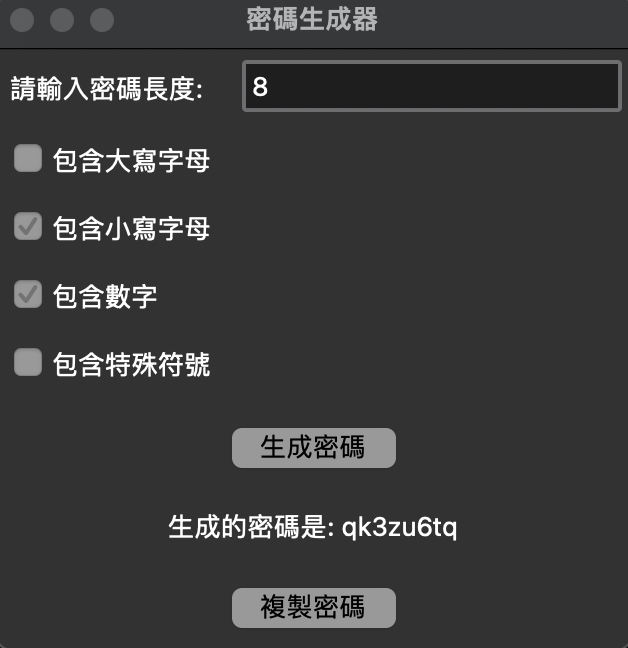

# 密碼生成器 (Password Generator)

這是一個用 Python 和 tkinter 寫的密碼生成器。用戶可以根據需求選擇密碼的長度和包含的字符類型（大寫字母、小寫字母、數字和特殊符號）。支援將生成的密碼複製起來。

## 功能
- 自定義密碼長度
- 可選擇是否包含大寫字母、小寫字母、數字、特殊符號
- 生成密碼後可以複製起來

## 截圖

## 使用方法
1. 輸入密碼長度。
2. 選擇包含的字符集（大寫字母、小寫字母、數字、特殊符號）。
3. 點擊「生成密碼」來生成密碼。
4. 點擊「複製密碼」將密碼複製。

## 安裝要求
- Python 3.x
- tkinter (預裝在 Python 中)
- pyperclip (用於剪貼板操作)

使用以下命令安裝 `pyperclip`：
pip install pyperclip

## 開始使用
運行 `password_generator.py` 文件，並開始生成您的密碼！

